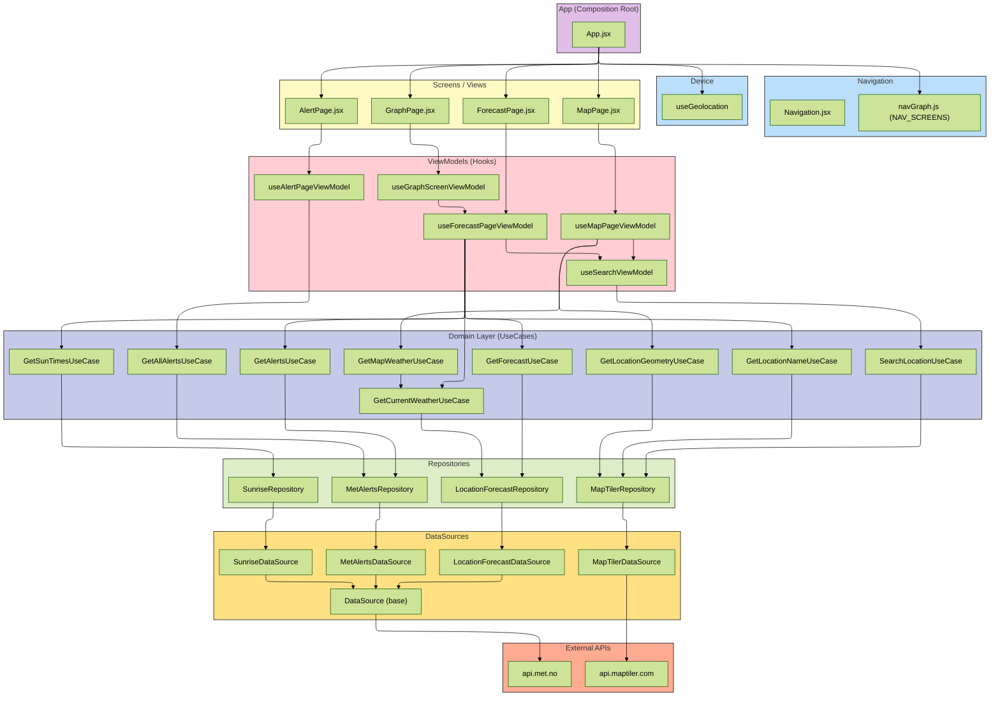

```mermaid
---
config:
  layout: elk
  elk:
    mergeEdges: true
    nodePlacementStrategy: NETWORK_SIMPLEX
    cycleBreakingStrategy: DEPTH_FIRST
    edgeRouting: ORTHOGONAL
  theme: forest
---
flowchart TB

%% =========================
%% APP LAYER (COMPOSITION ROOT)
%% =========================
subgraph AppLayer["App (Composition Root)"]
	App["App.jsx"]
end

%% =========================
%% NAVIGATION
%% =========================
subgraph NavigationLayer["Navigation"]
	NavGraph["navGraph.js (NAV_SCREENS)"]
	Navigation["Navigation.jsx"]
end

%% =========================
%% DEVICE
%% =========================
subgraph Device["Device"]
	GeoHook["useGeolocation"]
end

%% =========================
%% SCREENS
%% =========================
subgraph Screens["Screens / Views"]
	ForecastPage["ForecastPage.jsx"]
	GraphPage["GraphPage.jsx"]
	AlertPage["AlertPage.jsx"]
	MapPage["MapPage.jsx"]
end

%% =========================
%% VIEWMODELS (MVVM)
%% =========================
subgraph Hooks["ViewModels (Hooks)"]
	ForecastVM["useForecastPageViewModel"]
	GraphVM["useGraphScreenViewModel"]
	AlertVM["useAlertPageViewModel"]
	MapVM["useMapPageViewModel"]
	SearchVM["useSearchViewModel"]
end

%% =========================
%% DOMAIN / USECASES
%% =========================
subgraph UseCases["Domain Layer (UseCases)"]
	GetForecastUC["GetForecastUseCase"]
	GetAlertsUC["GetAlertsUseCase"]
	GetAllAlertsUC["GetAllAlertsUseCase"]
	GetCurrentUC["GetCurrentWeatherUseCase"]
	GetSunTimesUC["GetSunTimesUseCase"]
	SearchLocationUC["SearchLocationUseCase"]
	GetLocationNameUC["GetLocationNameUseCase"]
	GetMapWeatherUC["GetMapWeatherUseCase"]
	GetLocationGeometryUC["GetLocationGeometryUseCase"]
end

%% =========================
%% REPOSITORIES
%% =========================
subgraph Repositories["Repositories"]
	ForecastRepo["LocationForecastRepository"]
	AlertsRepo["MetAlertsRepository"]
	SunriseRepo["SunriseRepository"]
	MapTilerRepo["MapTilerRepository"]
end

%% =========================
%% DATASOURCES
%% =========================
subgraph DataSources["DataSources"]
	BaseDS["DataSource (base)"]
	ForecastDS["LocationForecastDataSource"]
	AlertsDS["MetAlertsDataSource"]
	SunriseDS["SunriseDataSource"]
	MapTilerDS["MapTilerDataSource"]
end

%% =========================
%% EXTERNAL APIS
%% =========================
subgraph ExternalAPI["External APIs"]
	MET["api.met.no"]
	MapTiler["api.maptiler.com"]
end

%% =========================
%% APP CONNECTIONS
%% =========================
App --> NavGraph
App --> GeoHook
App --> ForecastPage
App --> GraphPage
App --> AlertPage
App --> MapPage

%% =========================
%% SCREEN → VIEWMODEL
%% =========================
ForecastPage --> ForecastVM
GraphPage --> GraphVM
AlertPage --> AlertVM
MapPage --> MapVM

GraphVM --> ForecastVM
ForecastVM --> SearchVM
MapVM --> SearchVM

%% =========================
%% VIEWMODEL → USECASE
%% =========================
ForecastVM --> GetForecastUC
ForecastVM --> GetAlertsUC
ForecastVM --> GetCurrentUC
ForecastVM --> GetSunTimesUC
ForecastVM --> GetLocationNameUC

AlertVM --> GetAllAlertsUC

MapVM --> GetMapWeatherUC
MapVM --> GetLocationGeometryUC

SearchVM --> SearchLocationUC

%% =========================
%% USECASE → REPOSITORY
%% =========================
GetForecastUC --> ForecastRepo
GetCurrentUC --> ForecastRepo

GetAlertsUC --> AlertsRepo
GetAllAlertsUC --> AlertsRepo

GetSunTimesUC --> SunriseRepo

SearchLocationUC --> MapTilerRepo
GetLocationNameUC --> MapTilerRepo
GetLocationGeometryUC --> MapTilerRepo

GetMapWeatherUC --> GetCurrentUC

%% =========================
%% REPOSITORY → DATASOURCE
%% =========================
ForecastRepo --> ForecastDS
AlertsRepo --> AlertsDS
SunriseRepo --> SunriseDS
MapTilerRepo --> MapTilerDS

ForecastDS --> BaseDS
AlertsDS --> BaseDS
SunriseDS --> BaseDS

%% =========================
%% DATASOURCE → EXTERNAL
%% =========================
BaseDS --> MET
MapTilerDS --> MapTiler

%% =========================
%% STYLING
%% =========================
style AppLayer stroke:#000000,fill:#E1BEE7
style NavigationLayer stroke:#000000,fill:#BBDEFB
style Screens stroke:#000000,fill:#FFF9C4
style Hooks stroke:#000000,fill:#FFCDD2
style UseCases stroke:#000000,fill:#C5CAE9
style Repositories stroke:#000000,fill:#DCEDC8
style DataSources stroke:#000000,fill:#FFE082
style ExternalAPI stroke:#000000,fill:#FFAB91
style Device stroke:#000000,fill:#BBDEFB
```