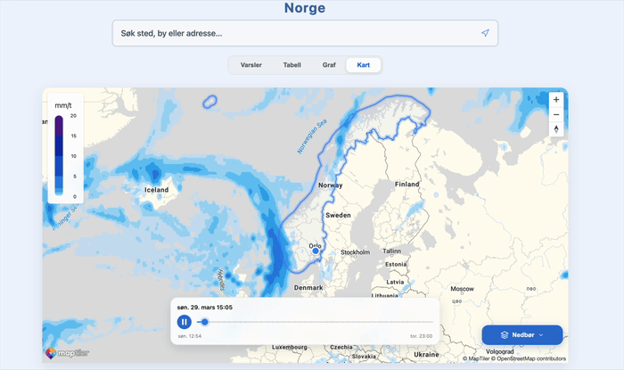

# VærVarselet

VærVarselet er et personlig prosjekt laget for å lære og utforske **MVVM-arkitektur i React**.  
Applikasjonen henter værdata fra **Meteorologisk institutt (MET)**, er inspirert av **Yr.no**, og kombinerer dette med kart, værvisualisering, grafvisning og stedssøk.

Prosjektet er bygget som en MVVM-inspirert frontend-applikasjon der ansvaret er delt mellom:

- **Model** – datasource, repositories og use cases
- **ViewModel** – hooks som holder UI-tilstand og presentasjonslogikk
- **View** – React-komponenter og pages

**Målet med prosjektet har vært å:**
Målet med denne appen har vært å lære MVVM-arkitektur i React.
Hensikten med å skrive koden etter denne arkitekturen, er at dette igjennom tydelig lagdeling og ansvarsdeling vil kunne redusere komplesitene og håndtere den på en måte gjør appen mer testbar, utvidbar, forståelig og vedlikeholdbar. 

**Teknologier og eksterne biblioteker som brukes av appen er:**
- <a href="https://react.dev/">**React**</a>
- <a href="https://vite.dev/">**Vite**</a>
- <a href="https://www.maptiler.com/">**MapTiler**</a>
- <a href="https://www.maptiler.com/weather/">**MapTiler Weather**</a>
- <a href="https://www.highcharts.com/">**Highcharts**</a>
- <a href="https://moment.github.io/luxon/">**Luxon**</a>
- <a href="https://www.npmjs.com/package/tz-lookup">**tz-lookup**</a>


**Features i appen**
Sentrale features i appen er værvarsel for valgt lokasjon, grafvisning av værdata, farevarsler og kartvisning med markører og geometri. Appen bruker også vær-layers via MapTiler Weather for å visualisere værforhold direkte i kartet, og den støtter søk og håndtering av aktiv lokasjon. I tillegg er presentasjonen av data tidssonebevisst, slik at værinformasjonen vises i riktig lokal tid for stedet som er valgt.


<table align="center">
  <tr>
    <th>Kartlag: Nedbør</th>
    <th>Kartlag: Temperatur</th>
  </tr>
  <tr>
    <td>
      
    </td>
    <td>
      
    </td>
  </tr>
  <tr>
    <th>Bytte av kartlag</th>
    <th>Kartlag: Vind</th>
  </tr>
  <tr>
    <td>
      
    </td>
    <td>
      
    </td>
  </tr>
</table>

---

## Dokumentasjon

<table>
    <tr>
        <th>Seksjon</th>
        <th>Beskrivelse</th>
    </tr>
    <tr>
        <td>Oppsett</td>
        <td><a href="./docs/SETUP.md">Installasjon, oppstart, miljøvariabler og lokal konfigurasjon.</a></td>
    </tr>
    <tr>
        <td>Arkitektur</td>
        <td><a href="./docs/ARCHITECTURE.md">Beskrivelse av MVVM-strukturen, lagdeling og designvalg.</a></td>
    </tr>
    <tr>
        <td>Pages</td>
        <td><a href="./docs/PAGES.md">Oversikt over sidene i appen og hva de har ansvar for.</a></td>
    </tr>
    <tr>
        <td>MapPage</td>
        <td><a href="./docs/MAP_PAGE.md">Detaljert dokumentasjon av MapPage, kartlag, markører, highlight og kartlogikk.</a></td>
    </tr>
    <tr>
        <td>Tidssoner</td>
        <td><a href="./docs/TIMEZONES.md">Hvordan appen håndterer UTC, lokal tid, tidssoner og lokasjonsdata.</a></td>
    </tr>
    <tr>
        <td>Testing</td>
        <td><a href="./docs/TESTING.md">Teststruktur, testformål og hvordan testene kjøres.</a></td>
    </tr>
</table>

---

## Hurtigstart

**Installer avhengigheter:**

```bash
npm install
```

**Installer sentrale pakker i prosjektet:**

```bash
npm install @maptiler/sdk
npm install @maptiler/weather
npm install @maptiler/marker-layout
npm install highcharts highcharts-react-official
npm install luxon tz-lookup
```

**Opprett bruker hos MapTiler, API-nøkke og `.env` fil for miljøvariabler**

Legg inn nødvendige miljøvariabler for karttjenesten, må du opprette en MapTiler-bruker og API-nøkkel. 
Dette er gratis og gjøres på følgende måte:

<table>
    <tr>
        <th>Steg</th>
        <th>Beskrivelse</th>
    </tr>
    <tr>
        <td>1</td>
        <td>Gå til <a href="https://www.maptiler.com/">MapTiler</a>.</td>
    </tr>
    <tr>
        <td>2</td>
        <td>Opprett en bruker og logg inn i kontoen din.</td>
    </tr>
    <tr>
        <td>3</td>
        <td>Opprett eller hent en API-nøkkel.</td>
    </tr>
    <tr>
        <td>4</td>
        <td>Opprett en <code>.env</code>-fil i prosjektroten, altså på øverste nivå i prosjektmappen.</td>
    </tr>
</table>

**Legg deretter inn nøkkelen slik:**

```env
VITE_MAPTILER_API_KEY=din_maptiler_nøkkel
```

**Når dette er gjort vil `MapTilerDataSource.js` laste inn nøkkelen**

I modellen og datalaget ligger filen `MapTilerDataSource.js`. 
Denne vil da laste inn API-nøkkelen og gjøre stedsøk og bruk av kartløsning mulig.

Dette ser du øverst i denne kodeblokken:

```javascript
//src/model/datasource/MapTilerDataSource.js
const API_KEY = import.meta.env.VITE_MAPTILER_API_KEY;

export default class MapTilerDataSource {
	#apiKey = API_KEY;
	#baseUrl = "https://api.maptiler.com/geocoding";

...

}
```

Når API-nøkkel er lagt inn i `.env`-filen så kan du

**Starte utviklingsserveren og kjøre prosjektet lokalt på maskinen din**

```bash
npm run dev
```

Se <a href="./docs/SETUP.md">SETUP.md</a> for mer informasjon om installasjon, miljøvariabler og lokal konfigurasjon.

---


## Arkitektur

Under ser du en overordnet skisse av appen arkitektur og lagindeling.


Denne arkitekturen fordeler seg slik i prosjektets mappestruktur.

```bash
.
├── images
├── public
├── src
│   ├── geolocation
│   ├── navigation
│   ├── model                               <- Model
│   │   ├── datasource
│   │   ├── domain
│   │   └── repositories
│   └── ui
│       ├── hooks
│       ├── style
│       ├── utils
│       ├── view                            <- View
│       │   ├── components
│       │   │   ├── Common
│       │   │   ├── ForecastPage
│       │   │   ├── GraphPage
│       │   │   ├── AlertPage
│       │   │   └── MapPage
│       │   └── pages
│       │       ├── ForecastPage.jsx
│       │       ├── GraphPage.jsx
│       │       ├── AlertPage.jsx
│       │       └── MapPage.jsx
│       └── viewmodel                       <- ViewModel
│           ├── ForecastPageViewModel.js
│           ├── GraphPageViewModel.js
│           ├── AlertPageViewModel.js
│           └── MapPageViewModel.js
└── test
    ├── model
    └── ui
```

---


## Kreditering og datakilder

VærVarselet bygger på eksterne datakilder, biblioteker og visuelle ressurser for værdata, kart, grafer, tidssoner og ikoner.

<table border="1">
    <tr>
        <th>Ressurs</th>
        <th>Bruk i prosjektet</th>
        <th>Lenke</th>
    </tr>
    <tr>
        <td>Meteorologisk institutt (MET)</td>
        <td>Værdata og varseldata</td>
        <td><a href="https://www.met.no/">met.no</a></td>
    </tr>
    <tr>
        <td>Yr.no</td>
        <td>Inspirasjon for presentasjon og værkontekst</td>
        <td><a href="https://www.yr.no/">yr.no</a></td>
    </tr>
    <tr>
        <td>MapTiler</td>
        <td>Kartvisning og kartrelaterte tjenester</td>
        <td><a href="https://www.maptiler.com/">maptiler.com</a></td>
    </tr>
    <tr>
        <td>MapTiler Weather</td>
        <td>Vær-layers og væranimasjoner i kartet</td>
        <td><a href="https://www.maptiler.com/weather/">maptiler.com/weather</a></td>
    </tr>
    <tr>
        <td>Highcharts</td>
        <td>Grafvisualisering av værdata</td>
        <td><a href="https://www.highcharts.com/">highcharts.com</a></td>
    </tr>
    <tr>
        <td>Luxon</td>
        <td>Dato-, tid- og tidssonehåndtering</td>
        <td><a href="https://moment.github.io/luxon/">Luxon</a></td>
    </tr>
    <tr>
        <td>tz-lookup</td>
        <td>Fallback for tidssone basert på koordinater</td>
        <td><a href="https://www.npmjs.com/package/tz-lookup">tz-lookup</a></td>
    </tr>
    <tr>
        <td>Yr Weather Symbols</td>
        <td>Værikoner</td>
        <td><a href="https://nrkno.github.io/yr-weather-symbols/">Yr Weather Symbols</a></td>
    </tr>
    <tr>
        <td>Yr Warning Icons</td>
        <td>Fareikoner</td>
        <td><a href="https://nrkno.github.io/yr-warning-icons/">Yr Warning Icons</a></td>
    </tr>
</table>

Prosjektets footer oppsummerer også krediteringen i applikasjonen, inkludert MET, Yr, MapTiler, Highcharts og ikonressursene fra NRK.