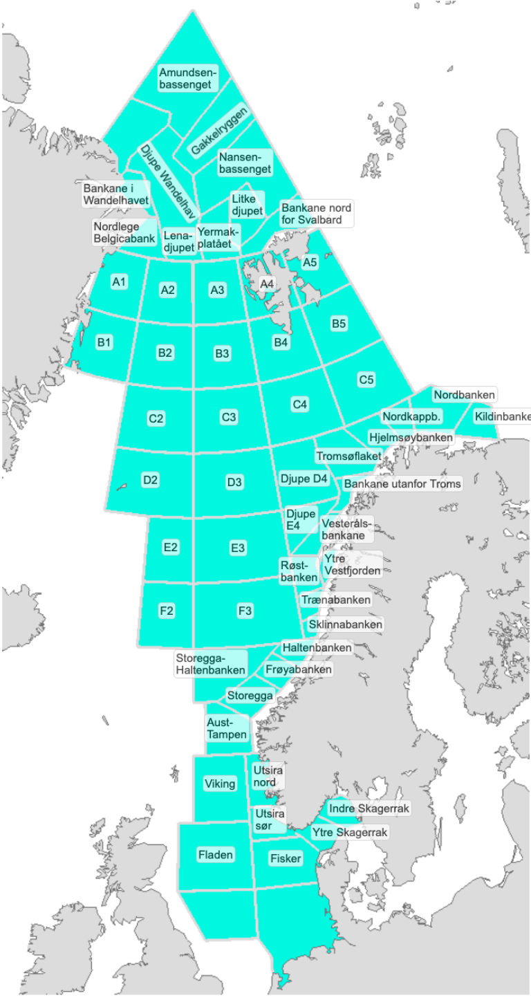

# VærVarselet – testprosjekt for å lære MVVM i React

VærVarselet er et personlig prosjekt laget for å lære og utforske **MVVM-arkitektur i React**.  
Applikasjonen henter værdata fra **Meteorologisk institutt (MET)**, er inspirert av **Yr.no**, og kombinerer dette med kart, værvisualisering, grafvisning og stedssøk.

Prosjektet er bygget som en MVVM-inspirert frontend-applikasjon der ansvaret er delt mellom:

- **Model** – datasource, repositories og use cases
- **ViewModel** – hooks som holder UI-tilstand og presentasjonslogikk
- **View** – React-komponenter og pages

I tillegg bruker appen **MapTiler** for kart og stedsdata, **MapTiler Weather** for væranimasjoner på kartet og **Highcharts** for grafvisualisering.

---

# Innholdsfortegnelse

1. [Kjøre prosjektet](#1-kjøre-prosjektet)  
2. [Installasjon](#2-installasjon)  
3. [Arkitektur og oppbygging](#3-arkitektur-og-oppbygging)  
4. [MapPage og ny struktur](#4-mappage-og-ny-struktur)  
5. [Tidssoner og lokasjon](#5-tidssoner-og-lokasjon)  
6. [Biblioteker, datakilder og kreditering](#6-biblioteker-datakilder-og-kreditering)  
7. [Forenklet mappestruktur](#7-forenklet-mappestruktur)  
8. [Arkitekturdiagram](#8-arkitekturdiagram)  
9. [Varslingsområder for hav og kyst](#9-varslingsområder-for-hav-og-kyst)  
10. [Kildehenvisning for ikoner](#10-kildehenvisning-for-ikoner)  

---

# 1. Kjøre prosjektet

## 1.1 Starte utviklingsserver

For å starte prosjektet lokalt:

```bash
npm run dev
````

Dette åpner prosjektet i en lokal dev-server via Vite.

## 1.2 Standard oppsett etter nedlasting

Dersom du nettopp har klonet prosjektet, installer først avhengighetene:

```bash
npm install
```

Deretter kan du starte prosjektet med:

```bash
npm run dev
```

---

# 2. Installasjon

Vanligvis holder det å kjøre:

```bash
npm install
```

fordi alle dependencies ligger i `package.json`.

Hvis du setter opp tilsvarende prosjekt manuelt, er dette pakkene som brukes for sentral funksjonalitet i appen:

## 2.1 Kart og kartvær

```bash
npm install @maptiler/sdk
npm install @maptiler/weather
npm install @maptiler/marker-layout
```

Disse brukes til:

* kartvisning
* visualisering av vær-layers som vind og skyer
* markør- og kartrelatert funksjonalitet

## 2.2 Grafvisning

```bash
npm install highcharts highcharts-react-official
```

Disse brukes til:

* temperaturgrafer
* vindgrafer
* UV-indeks
* andre tidsseriebaserte værvisualiseringer

## 2.3 Tidssoner og lokasjon

```bash
npm install luxon tz-lookup
```

Disse brukes til:

* robust håndtering av UTC og lokal tid
* konvertering mellom tidssoner
* fallback for tidssone basert på koordinater

---

# 3. Arkitektur og oppbygging

Prosjektet er strukturert etter en **MVVM-inspirert arkitektur**.

## 3.1 Model

Model-laget består av:

* **Datasource-laget**
* **Repository-laget**
* **UseCase-/domain-laget**

### Datasource

Datasource-laget har ansvar for kommunikasjon med eksterne API-er og datakilder.

### Repository

Repository-laget mapper, filtrerer og strukturerer rådata til et format resten av appen kan bruke.

### UseCases

UseCases representerer eksplisitte handlinger i applikasjonen, som for eksempel:

* hente værdata
* søke etter lokasjoner
* hente geometri for områder
* hente værpunkter til kart
* hente varsler og metadata

Dette gjør flyten tydeligere og flytter applikasjonslogikk bort fra UI-laget.

---

## 3.2 ViewModel

Hver side har sin egen ViewModel, implementert som en custom hook.

Eksempler på ViewModels i prosjektet er:

* `ForecastPageViewModel`
* `GraphPageViewModel`
* `AlertPageViewModel`
* `MapPageViewModel`

ViewModel-laget har ansvar for:

* UI-state
* presentasjonslogikk
* orkestrering av use cases
* transformasjon av data til noe View-laget kan rendre

ViewModel-laget skal **ikke** kjenne til detaljer om hvordan data hentes fra API-er.

---

## 3.3 View

View-laget består av React-komponenter og pages.

* Hver page er en funksjonskomponent
* Hver page består av flere mindre komponenter
* View-laget skal være mest mulig fokusert på presentasjon

Typisk oppdeling:

* `src/ui/view/pages` – toppnivå-sider
* `src/ui/view/components` – gjenbrukbare og side-spesifikke komponenter

---

## 3.4 App.jsx som komposisjonsrot

`App.jsx` fungerer som appens komposisjonsrot og samlingspunkt for delt tilstand.

Her settes sentrale avhengigheter sammen, og felles state løftes opp når flere sider trenger samme datagrunnlag.
Et viktig eksempel er aktiv lokasjon, som fungerer som en **single source of truth** for flere sider i appen.

---

# 4. MapPage og ny struktur

En viktig del av den nyere arkitekturen er at kartfunksjonaliteten er skilt tydeligere ut i egen page og egne komponenter.

## 4.1 Hva MapPage har ansvar for

`MapPage` er siden som håndterer kartrelatert funksjonalitet, blant annet:

* visning av kart
* bytte av kartlag
* markører og synlige kartpunkter
* geometri/highlight av valgte områder
* værpunkter i kartet
* reset til enhetens posisjon
* kartkamera / map target
* vær-layers fra MapTiler Weather

Dette gjør at kartlogikken ikke lenger ligger spredt i tilfeldige komponenter, men er samlet i en egen del av appen.

## 4.2 MapPageViewModel

`MapPageViewModel` har ansvar for kartets presentasjonslogikk og UI-state, som for eksempel:

* aktiv highlight-geometri
* synlige værpunkter
* zoomnivå
* viewport-bounds
* valgt kartlag
* toggling av markører
* håndtering av reset til device location

Med andre ord holder ViewModelen styr på **hvordan kartet skal oppføre seg**, mens View kun gjengir tilstanden.

## 4.3 MapPage-komponenter

Komponentene knyttet til kartsiden ligger typisk under en egen mappe for `MapPage`, slik at kartrelatert UI er samlet og enklere å vedlikeholde.

Det kan for eksempel være komponenter for:

* kartcontainer
* kartlag-toggle
* vær-layer-kontroller
* markører
* highlight-visning
* kontrollknapper for navigasjon og reset

Denne strukturen gir høyere kohesjon og gjør det lettere å videreutvikle kartfunksjonaliteten uten å påvirke resten av appen unødvendig.

## 4.4 Lokasjonshåndtering

Lokasjon er nå tydeligere modellert som et eget konsept i appen.

Appen skiller mellom:

* **enhetens posisjon**
* **manuelt valgt lokasjon**
* **beriket lokasjon**, for eksempel med navn, type, bounds og tidssone

Dette gjør at kart, søk og værpresentasjon kan bruke samme lokasjonsgrunnlag på en mer konsistent måte.

---

# 5. Tidssoner og lokasjon

Applikasjonen er designet for å være geografisk agnostisk. All værdata fra MET leveres i UTC (`...Z`), og denne beholdes uendret gjennom datastrømmen. Konvertering til lokal tid skjer deterministisk ved bruk av IANA-tidssoner.

## 5.1 Rådata fra MET

Data hentes fra MET og lagres med UTC som primærkilde:

```js
{
  time: "2026-03-02T17:00:00Z",
  data: { ... }
}
```

## 5.2 Lokasjon og tidssone som single source of truth

Når brukeren søker etter en lokasjon, eller når appen bruker device location, bygges det opp et aktivt lokasjonsobjekt som inneholder informasjon som:

* navn
* koordinater
* type
* bounds
* countryCode
* tidssone

Hvis en ekstern tjeneste ikke returnerer tidssone eksplisitt, brukes `tz-lookup` som fallback basert på koordinater.

## 5.3 Hvorfor dette er nyttig

Dette sikrer korrekt håndtering av:

* sommertid (DST)
* lokasjoner i ulike IANA-tidssoner
* steder med uvanlige UTC-offsets
* visning av riktig lokal dato og klokkeslett i hele appen

## 5.4 Designvalg

Prosjektet følger noen bevisste prinsipper:

* **ingen mutasjon av rådata**
* **eksplisitte parametere for tidssone og lokasjon**
* **ingen manuell hardkoding av UTC-offset**
* **stabil modell uavhengig av brukerens egen tidssone**

---

# 6. Biblioteker, datakilder og kreditering

Under er en samlet oversikt over eksterne biblioteker, dataleverandører og visuelle ressurser som brukes i prosjektet.

<table border="1">
    <tr>
        <th>Navn</th>
        <th>Type</th>
        <th>Bruk i prosjektet</th>
        <th>Lenke</th>
    </tr>
    <tr>
        <td>Meteorologisk institutt (MET)</td>
        <td>Dataleverandør</td>
        <td>Leverer værdata og varseldata som brukes i appen.</td>
        <td>https://www.met.no/</td>
    </tr>
    <tr>
        <td>Yr.no</td>
        <td>Inspirasjon / datanær kontekst</td>
        <td>Appen er inspirert av Yr.no sin presentasjon av værdata. Footer og kreditering peker også til Yr som del av datakonteksten.</td>
        <td>https://www.yr.no/</td>
    </tr>
    <tr>
        <td>MapTiler</td>
        <td>Kartplattform</td>
        <td>Brukes til kartvisning, stedsdata og kartrelaterte tjenester.</td>
        <td>https://www.maptiler.com/</td>
    </tr>
    <tr>
        <td>MapTiler Weather</td>
        <td>Værvisualisering på kart</td>
        <td>Brukes til animerte vær-layers som vind og andre værvisualiseringer på kartet.</td>
        <td>https://www.maptiler.com/weather/</td>
    </tr>
    <tr>
        <td>@maptiler/sdk</td>
        <td>JavaScript-bibliotek</td>
        <td>SDK for kartfunksjonalitet fra MapTiler i React-applikasjonen.</td>
        <td>https://www.maptiler.com/</td>
    </tr>
    <tr>
        <td>@maptiler/weather</td>
        <td>JavaScript-bibliotek</td>
        <td>Brukes for vær-layers og animasjoner på kartet.</td>
        <td>https://www.maptiler.com/weather/</td>
    </tr>
    <tr>
        <td>@maptiler/marker-layout</td>
        <td>JavaScript-bibliotek</td>
        <td>Brukes til håndtering av kartmarkører og marker-relatert layout.</td>
        <td>https://www.maptiler.com/</td>
    </tr>
    <tr>
        <td>Highcharts</td>
        <td>Visualiseringsbibliotek</td>
        <td>Brukes til å vise interaktive grafer for værdata.</td>
        <td>https://www.highcharts.com/</td>
    </tr>
    <tr>
        <td>highcharts-react-official</td>
        <td>React-wrapper</td>
        <td>Brukes som React-integrasjon for Highcharts.</td>
        <td>https://www.highcharts.com/</td>
    </tr>
    <tr>
        <td>Luxon</td>
        <td>Tidsbibliotek</td>
        <td>Brukes til robust håndtering av dato, tid, UTC og tidssoner.</td>
        <td>https://moment.github.io/luxon/</td>
    </tr>
    <tr>
        <td>tz-lookup</td>
        <td>Hjelpebibliotek</td>
        <td>Brukes som fallback for å finne tidssone basert på koordinater.</td>
        <td>https://www.npmjs.com/package/tz-lookup</td>
    </tr>
    <tr>
        <td>Yr Weather Symbols</td>
        <td>Ikonsett</td>
        <td>Brukes til værikoner i applikasjonen.</td>
        <td>https://nrkno.github.io/yr-weather-symbols/</td>
    </tr>
    <tr>
        <td>Yr Warning Icons</td>
        <td>Ikonsett</td>
        <td>Brukes til fareikoner og varslingsikoner i applikasjonen.</td>
        <td>https://nrkno.github.io/yr-warning-icons/</td>
    </tr>
</table>

---

# 6.1 Kreditering fra applikasjonen

Applikasjonens footer oppsummerer prosjektet slik:

* Dette er et personlig prosjekt for å lære MVVM-arkitektur i React
* All data er hentet fra Meteorologisk institutt (MET)
* Løsningen er inspirert av Yr.no
* Værikoner er hentet fra **Yr Weather Symbols**
* Fareikoner er hentet fra **Yr Warning Icons**
* Kart og kartrelatert visualisering leveres med støtte fra **MapTiler**
* Grafvisning er bygget med **Highcharts**

---

# 7. Forenklet mappestruktur

```bash
.
├── images
├── public
├── src
│   ├── geolocation
│   ├── navigation
│   ├── model                               <- Model
│   │   ├── datasource
│   │   ├── domain
│   │   └── repositories
│   └── ui
│       ├── hooks
│       ├── style
│       ├── utils
│       ├── view                            <- View
│       │   ├── components
│       │   │   ├── Common
│       │   │   ├── ForecastPage
│       │   │   ├── GraphPage
│       │   │   ├── AlertPage
│       │   │   └── MapPage
│       │   └── pages
│       │       ├── ForecastPage.jsx
│       │       ├── GraphPage.jsx
│       │       ├── AlertPage.jsx
│       │       └── MapPage.jsx
│       └── viewmodel                       <- ViewModel
│           ├── ForecastPageViewModel.js
│           ├── GraphPageViewModel.js
│           ├── AlertPageViewModel.js
│           └── MapPageViewModel.js
└── test
    ├── model
    └── ui
```

---

# 8. Arkitekturdiagram

Prosjektet inneholder også en arkitekturtegning som illustrerer lagdelingen i løsningen.


---

# 9. Varslingsområder for hav og kyst

Applikasjonen forholder seg også til polygoner og geografiske områder for varslinger knyttet til hav og kyst.



Se mer informasjon hos Meteorologisk institutt:

[https://www.met.no/vaer-og-klima/ekstremvaervarsler-og-andre-farevarsler/varslingsomrader-kyst-og-hav](https://www.met.no/vaer-og-klima/ekstremvaervarsler-og-andre-farevarsler/varslingsomrader-kyst-og-hav)

---

# 10. Kildehenvisning for ikoner

**NRK. (u.å.)** *Yr weather symbols.*
Hentet fra:
[https://nrkno.github.io/yr-weather-symbols/](https://nrkno.github.io/yr-weather-symbols/)

**NRK. (u.å.)** *Yr Warning Icons.*
Hentet fra:
[https://nrkno.github.io/yr-warning-icons/](https://nrkno.github.io/yr-warning-icons/)

---

# Kort oppsummert om arkitekturvalget

Dette prosjektet er ikke laget som full Domain-Driven Design, men som en pragmatisk og bevisst MVVM-inspirert struktur i React.

Målet med denne oppdelingen er å:

* redusere kognitiv kompleksitet i UI-laget
* gjøre ansvarsfordelingen tydeligere
* øke testbarhet og lesbarhet
* gjøre videreutvikling enklere
* samle applikasjonslogikk i use cases og repositories i stedet for i komponentene

Resultatet er en løsning der View-laget kan være fokusert på presentasjon, mens ViewModel og Model tar seg av logikk, datastrøm og koordinering.
