<h1 align="center">
  Hva bør du vite om
  <br>
  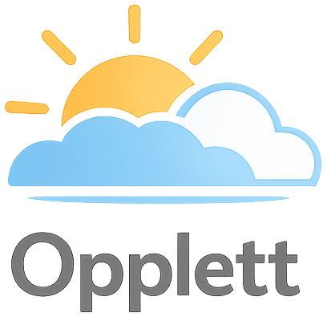
  
</h1>

<br>

Opplett er et personlig prosjekt laget for å lære og utforske **MVVM-arkitektur i React**.  
Applikasjonen henter værdata fra **Meteorologisk institutt (MET)**, er inspirert av **Yr.no**, og kombinerer dette med kart, værvisualisering, grafvisning og stedssøk.

Prosjektet er bygget som en MVVM-inspirert frontend-applikasjon der ansvaret er delt mellom:

- **Model** – datasource, repositories og use cases
- **ViewModel** – hooks som holder UI-tilstand og presentasjonslogikk
- **View** – React-komponenter og pages

**Målet med prosjektet har vært å lære MVVM-arkitektur i React.**  
Hensikten med å strukturere appen på denne måten er å bruke tydelig lagdeling og ansvarsdeling for å redusere kompleksitet, og samtidig gjøre appen mer testbar, utvidbar, forståelig og vedlikeholdbar.

**Prosjektet bruker blant annet:**
- <a href="https://react.dev/">**React**</a>
- <a href="https://vite.dev/">**Vite**</a>
- <a href="https://www.maptiler.com/">**MapTiler**</a>
- <a href="https://www.maptiler.com/weather/">**MapTiler Weather**</a>
- <a href="https://www.highcharts.com/">**Highcharts**</a>
- <a href="https://moment.github.io/luxon/">**Luxon**</a>
- <a href="https://www.npmjs.com/package/tz-lookup">**tz-lookup**</a>

**Sentrale funksjoner i appen**  
Appen tilbyr værvarsel for valgt lokasjon, grafvisning av værdata, farevarsler og kartvisning med markører og geometri. Den bruker også vær-layers via MapTiler Weather for å visualisere værforhold direkte i kartet, og støtter søk og håndtering av aktiv lokasjon. I tillegg er presentasjonen av data tidssonebevisst, slik at værinformasjonen vises i riktig lokal tid for stedet som er valgt.

<br>

---

## 1) Innholdsfortegnelse

<table>
    <tr>
        <th>Seksjon</th>
        <th>Beskrivelse</th>
    </tr>
    <tr>
        <td>Showcase</td>
        <td><a href="#2-showcase-av-features">Visuell demonstrasjon av sentrale funksjoner i appen.</a></td>
    </tr>
    <tr>
        <td>Oppsett</td>
        <td><a href="./docs/SETUP.md">Installasjon, oppstart, miljøvariabler og lokal konfigurasjon.</a></td>
    </tr>
    <tr>
        <td>Arkitektur</td>
        <td><a href="./docs/ARCHITECTURE.md">Beskrivelse av MVVM-strukturen, lagdeling og designvalg.</a></td>
    </tr>
    <tr>
        <td>Pages</td>
        <td><a href="./docs/PAGES.md">Oversikt over sidene i appen og hva de har ansvar for.</a></td>
    </tr>
    <tr>
        <td>MapPage</td>
        <td><a href="./docs/MAP_PAGE.md">Detaljert dokumentasjon av MapPage, kartlag, markører, highlight og kartlogikk.</a></td>
    </tr>
    <tr>
        <td>Tidssoner</td>
        <td><a href="./docs/TIMEZONES.md">Hvordan appen håndterer UTC, lokal tid, tidssoner og lokasjonsdata.</a></td>
    </tr>
    <tr>
        <td>Testing</td>
        <td><a href="./docs/TESTING.md">Teststruktur, testformål og hvordan testene kjøres.</a></td>
    </tr>
</table>

---

## 2) Showcase av features

<p align="center">
  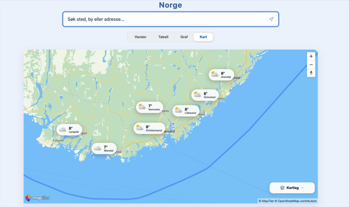
  <br>
  <sub><b>Stedsøk med nasjonal værmelding og highlighting av grenser</b></sub>
</p>

<br>

Denne funksjonen lar brukeren søke etter steder og få opp nasjonal værmelding knyttet til valgt område. Når lokasjonen representerer et geografisk område, kan appen også highlighte grensene i kartet for å gjøre det tydelig hvilket sted eller område værdataene gjelder for.

<br>

### Varselvisning

<table align="center">
  <tr>
    <td align="center" width="55%">
      <b>Langtidsvarsel</b><br><br>
      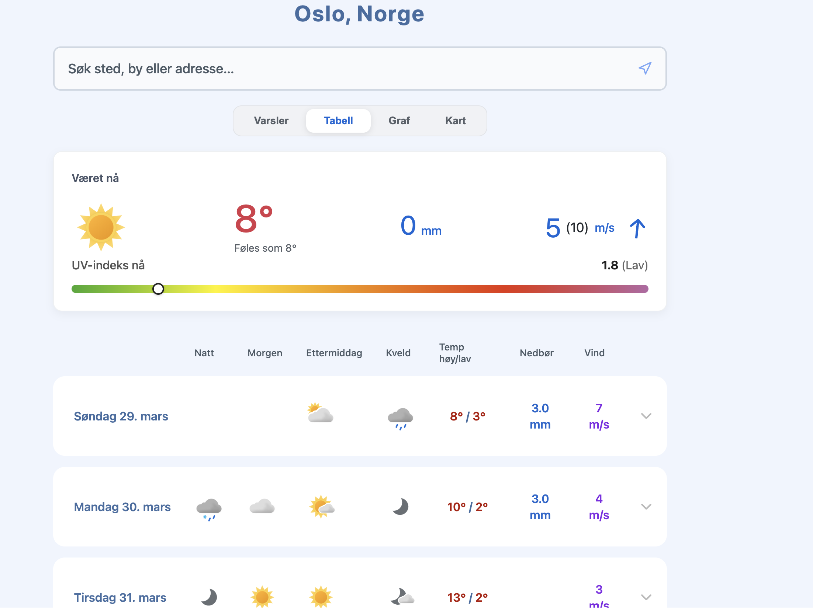
    </td>
    <td align="center" width="45%">
      <b>Timevarsel</b><br><br>
      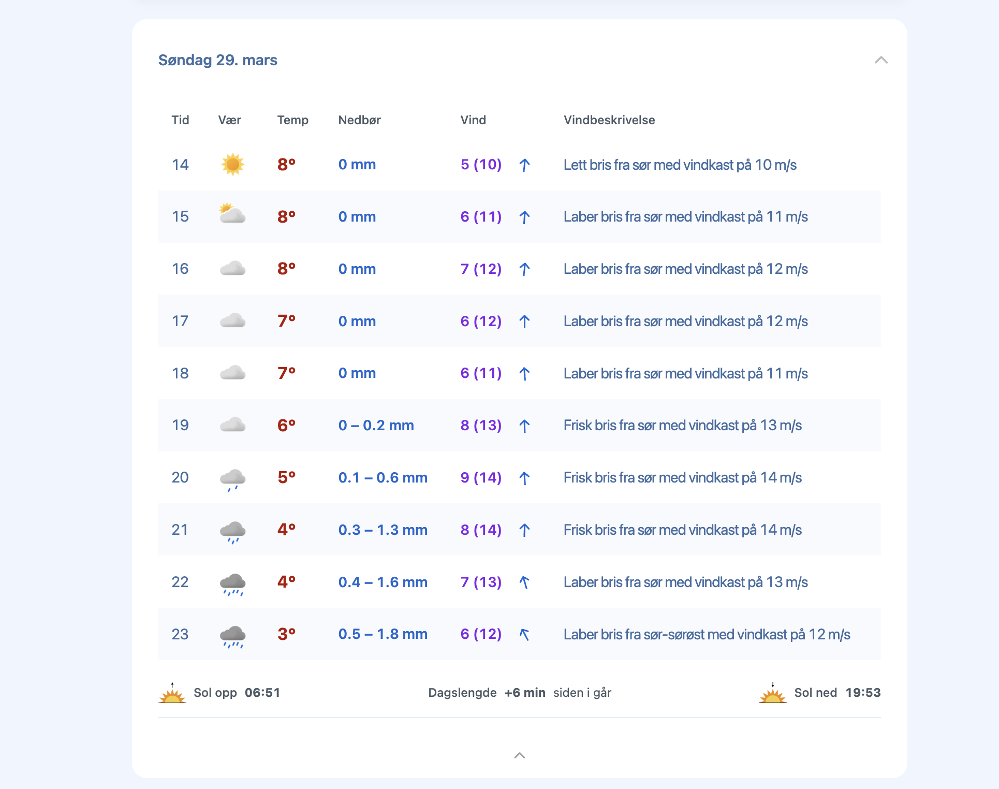
    </td>
  </tr>
</table>

<br>

Denne delen av appen gir både en overordnet og detaljert presentasjon av værutviklingen. Langtidsvarselet viser utviklingen dag for dag, mens timevarselet gir en mer finmasket oversikt over temperatur, nedbør, vind og andre værforhold gjennom døgnet.

<br>

### Grafvisning

<table align="center">
  <tr>
    <td align="center">
      <b>Meteogram</b><br><br>
      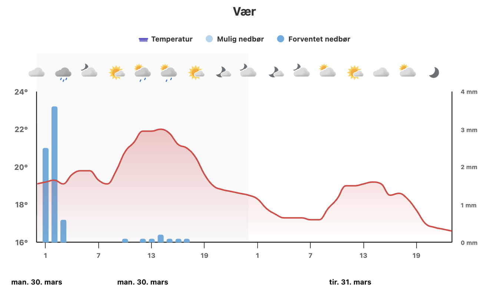
    </td>
    <td align="center">
      <b>Vindgraf</b><br><br>
      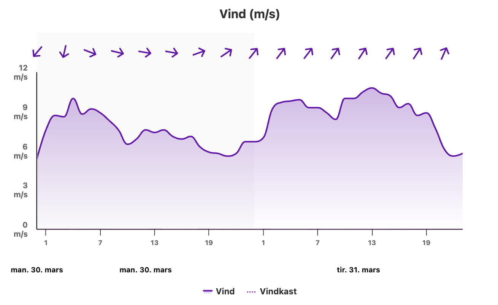
    </td>
    <td align="center">
      <b>Grafscroll</b><br><br>
      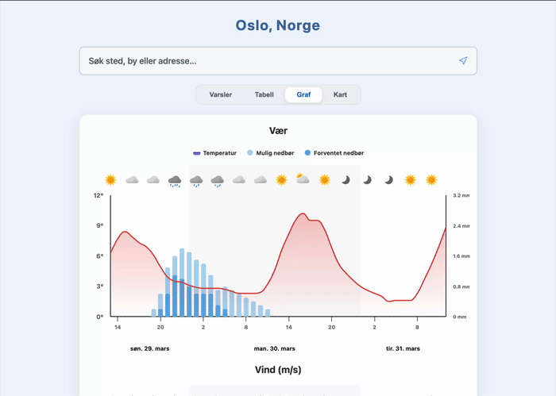
    </td>
  </tr>
</table>

<br>

Grafvisningen gjør det mulig å utforske værdata mer analytisk. I stedet for å bare lese tall og ikoner kan brukeren se utviklingen over tid i form av grafer, og scrolle gjennom visualiseringene for å få en mer detaljert forståelse av hvordan været endrer seg.

<br>

<table align="center">
  <tr>
    <td align="center">
      <b>UV-graf</b><br><br>
      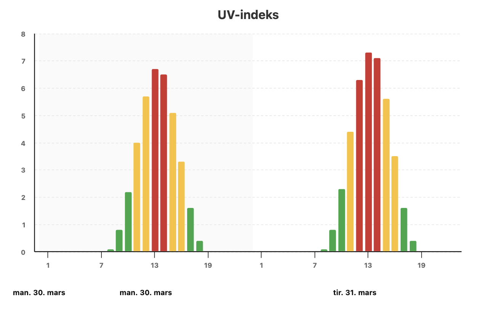
    </td>
    <td align="center">
      <b>Dagslysgraf</b><br><br>
      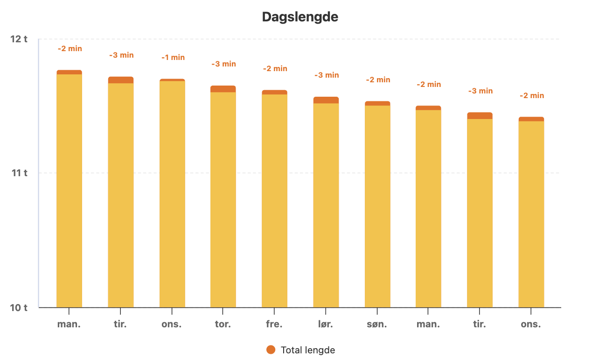
    </td>
    <td align="center">
      <b>Langtidsvarsel i bruk</b><br><br>
      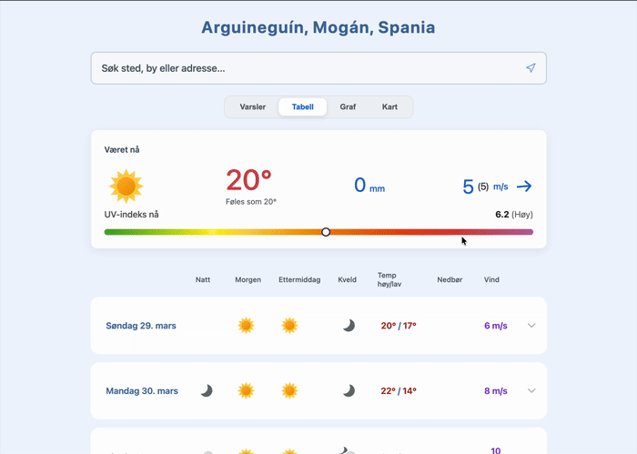
    </td>
  </tr>
</table>

<br>

I tillegg til meteogram og vindgraf støtter appen også egne grafer for UV-indeks og dagslys. Dette gjør at brukeren kan se flere sider av værbildet i samme grensesnitt, og langtidsvarselet kan brukes sammen med grafene for å gi både visuell oversikt og detaljert innsikt.

<br>

### Kart og vær-layers

<table align="center">
  <tr>
    <td align="center">
      <b>Nedbørskart</b><br><br>
      
    </td>
    <td align="center">
      <b>Temperaturkart</b><br><br>
      
    </td>
    <td align="center">
      <b>Vindkart</b><br><br>
      
    </td>
  </tr>
</table>

<br>

Kartdelen av appen gjør det mulig å visualisere været direkte i geografisk kontekst. Ved hjelp av egne vær-layers kan brukeren se nedbør, temperatur og vind i kartet, noe som gir en mer intuitiv forståelse av hvordan værforholdene fordeler seg over ulike områder.

<br>

### Bytte av kartlag

<p align="center">
  
  <br>
  <sub><b>Veksling mellom ulike vær-layers og kartvisninger</b></sub>
</p>

<br>

Denne funksjonen gjør det mulig å bytte mellom ulike kartlag og vær-layers i samme kartvisning. Det gir brukeren fleksibilitet til å veksle mellom forskjellige perspektiver på værdataene, og gjør kartet til et mer interaktivt og utforskende verktøy.

---

## 3) Hurtigstart og oppsett

**Installer avhengigheter:**

```bash
npm install
```

**Prosjektet bruker blant annet disse eksterne pakkene**
- `@maptiler/sdk`,  
- `@maptiler/weather`, 
- `@maptiler/marker-layout`, 
- `highcharts`, 
- `highcharts-react-official`,
- `luxon`
- `tz-lookup`.

**Opprett MapTiler-bruker, API-nøkkel og `.env`-fil**

For å bruke kartfunksjonaliteten må du opprette en MapTiler-bruker og hente en API-nøkkel. Dette er gratis og kan gjøres slik:

<table>
    <tr>
        <th>Steg</th>
        <th>Beskrivelse</th>
    </tr>
    <tr>
        <td>1</td>
        <td>Gå til <a href="https://www.maptiler.com/">MapTiler</a>.</td>
    </tr>
    <tr>
        <td>2</td>
        <td>Opprett en bruker og logg inn i kontoen din.</td>
    </tr>
    <tr>
        <td>3</td>
        <td>Opprett eller hent en API-nøkkel.</td>
    </tr>
    <tr>
        <td>4</td>
        <td>Opprett en <code>.env</code>-fil i prosjektroten, altså på øverste nivå i prosjektmappen.</td>
    </tr>
</table>

**Gjør altså følgende**

1) Gå til <a href="https://www.maptiler.com/">MapTiler</a>, opprett bruker, og finn API-nøkkelen i margen. Opprett API-nøkkel.

<p align="left">
  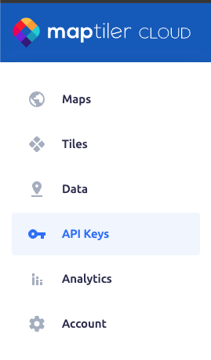
</p>

<br>

2) Opprett en <code>.env</code>-fil og legg inn dette:

<p align="left">
  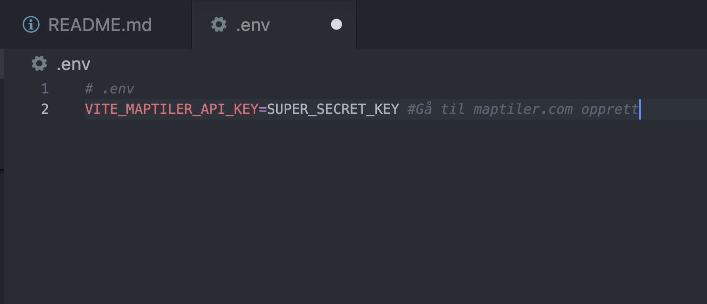
</p>

<br>


**Legg deretter inn nøkkelen slik:**

```env
VITE_MAPTILER_API_KEY=din_maptiler_nøkkel
```

**Slik brukes nøkkelen i prosjektet**

I modellaget ligger filen `MapTilerDataSource.js`. Denne leser inn API-nøkkelen fra miljøvariablene og gjør stedsøk og bruk av kartløsning mulig.

```javascript
// src/model/datasource/MapTilerDataSource.js
const API_KEY = import.meta.env.VITE_MAPTILER_API_KEY;

export default class MapTilerDataSource {
    #apiKey = API_KEY;
    #baseUrl = "https://api.maptiler.com/geocoding";

    ...
}
```

Når API-nøkkelen er lagt inn i `.env`-filen, kan du starte utviklingsserveren og kjøre prosjektet lokalt:

```bash
npm run dev
```

Se <a href="./docs/SETUP.md">SETUP.md</a> for mer informasjon om installasjon, miljøvariabler og lokal konfigurasjon.

---

## 4) Arkitektur

Under ser du en overordnet skisse av appens arkitektur og laginndeling.


Denne arkitekturen gjenspeiles i prosjektets mappestruktur:

```bash
.
├── images
├── public
├── src
│   ├── geolocation
│   ├── navigation
│   ├── model                               <- Model (M)
│   │   ├── datasource
│   │   ├── domain
│   │   └── repositories
│   └── ui
│       ├── hooks
│       ├── style
│       ├── utils
│       ├── view                            <- View (V)
│       │   ├── components
│       │   │   ├── Common
│       │   │   ├── ForecastPage
│       │   │   ├── GraphPage
│       │   │   ├── AlertPage
│       │   │   └── MapPage
│       │   └── pages
│       │       ├── ForecastPage.jsx
│       │       ├── GraphPage.jsx
│       │       ├── AlertPage.jsx
│       │       └── MapPage.jsx
│       └── viewmodel                       <- ViewModel (VM)
│           ├── ForecastPageViewModel.js
│           ├── GraphPageViewModel.js
│           ├── AlertPageViewModel.js
│           └── MapPageViewModel.js
└── test
    ├── model
    └── ui
```

<p>
  <a href="./docs/ARCHITECTURE.md"><b>Trykk her for mer informasjon om arkitekturen</b></a>
</p>

---

## 5) Kreditering og datakilder

VærVarselet i Opplett bygger på eksterne datakilder, biblioteker og visuelle ressurser for værdata, kart, grafer, tidssoner og ikoner.

<table border="1">
    <tr>
        <th>Ressurs</th>
        <th>Bruk i prosjektet</th>
        <th>Lenke</th>
    </tr>
    <tr>
        <td>Meteorologisk institutt (MET)</td>
        <td>Værdata og varseldata</td>
        <td><a href="https://www.met.no/">met.no</a></td>
    </tr>
    <tr>
        <td>Yr.no</td>
        <td>Inspirasjon for presentasjon og værkontekst</td>
        <td><a href="https://www.yr.no/">yr.no</a></td>
    </tr>
    <tr>
        <td>MapTiler</td>
        <td>Kartvisning og kartrelaterte tjenester</td>
        <td><a href="https://www.maptiler.com/">maptiler.com</a></td>
    </tr>
    <tr>
        <td>MapTiler Weather</td>
        <td>Vær-layers og væranimasjoner i kartet</td>
        <td><a href="https://www.maptiler.com/weather/">maptiler.com/weather</a></td>
    </tr>
    <tr>
        <td>Highcharts</td>
        <td>Grafvisualisering av værdata</td>
        <td><a href="https://www.highcharts.com/">highcharts.com</a></td>
    </tr>
    <tr>
        <td>Luxon</td>
        <td>Dato-, tid- og tidssonehåndtering</td>
        <td><a href="https://moment.github.io/luxon/">Luxon</a></td>
    </tr>
    <tr>
        <td>tz-lookup</td>
        <td>Fallback for tidssone basert på koordinater</td>
        <td><a href="https://www.npmjs.com/package/tz-lookup">tz-lookup</a></td>
    </tr>
    <tr>
        <td>Yr Weather Symbols</td>
        <td>Værikoner</td>
        <td><a href="https://nrkno.github.io/yr-weather-symbols/">Yr Weather Symbols</a></td>
    </tr>
    <tr>
        <td>Yr Warning Icons</td>
        <td>Fareikoner</td>
        <td><a href="https://nrkno.github.io/yr-warning-icons/">Yr Warning Icons</a></td>
    </tr>
</table>

Prosjektets `Footer-komponent` oppsummerer også krediteringen i applikasjonen, inkludert MET, Yr, MapTiler, Highcharts og ikonressursene fra NRK.