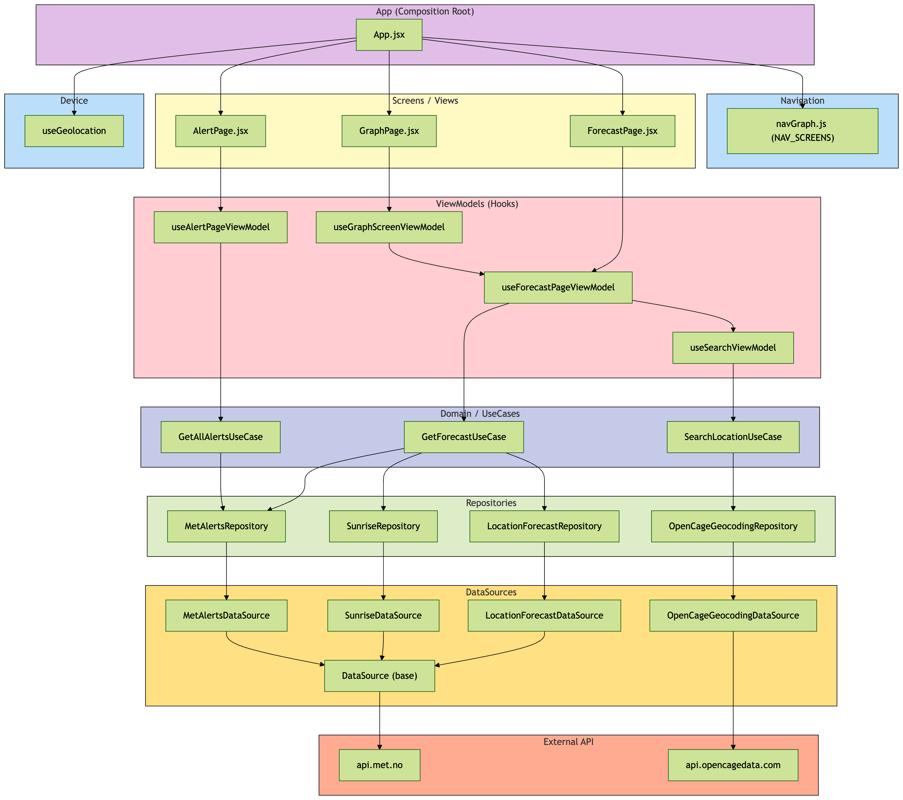

# Plan for å refakturere ut i Domene-lag med mål om å redusere kompleksitet i Viewmodell og Repository.

| UseCase                                            | Ansvar                                                                                          | Avhenger av                                                        | Returnerer                                                                   | Brukes av ViewModel   | Status                                     |
| -------------------------------------------------- | ----------------------------------------------------------------------------------------------- | ------------------------------------------------------------------ | ---------------------------------------------------------------------------- | --------------------- | ------------------------------------------ |
| **GetForecastUseCase**                             | Henter komplett værbilde for en lokasjon (hourly, daily summary, sunTimes, alerts for lokasjon) | LocationForecastRepository, SunriseRepository, MetAlertsRepository | `{ hourlyByDate, dailySummaryByDate, sunTimesByDate, alerts, alertsByDate }` | ForecastPageViewModel | Implementert                               |
| **GetAllAlertsUseCase**                            | Henter alle varsler i Norge (valgfritt filtrert på fylke)                                       | MetAlertsRepository                                                | `{ alerts, alertsByDate }`                                                   | AlertPageViewModel    | Implementert                               |
| **SearchLocationUseCase**                          | Søker etter sted, validerer input og mapper til Location-domeneobjekt                           | OpenCageGeocodingRepository                                        | `Location[]`                                                                 | SearchViewModel       | Bør implementeres                          |
| **GetAlertsForLocationUseCase** *(valgfri splitt)* | Henter varsler for spesifikk lat/lon og filtrerer evt. grønne                                   | MetAlertsRepository                                                | `{ alerts, alertsByDate }`                                                   | ForecastPageViewModel | Kun hvis du vil splitte GetForecastUseCase |
| **GetCurrentWeatherUseCase** *(kun ved behov)*     | Henter kun “vær nå” uavhengig av forecast                                                       | LocationForecastRepository                                         | `CurrentWeather`                                                             | ForecastPageViewModel | Ikke nødvendig nå                          |
| **GetSolarReportUseCase** *(kun ved behov)*        | Henter og beregner soldata uavhengig av forecast                                                | SunriseRepository                                                  | `{ [date]: SolarReport }`                                                    | ForecastPageViewModel | Ikke nødvendig nå                          |


## Refactor plan



```bash
---
config:
  theme: forest
  layout: fixed
---
flowchart TB

%% =========================
%% APP LAYER
%% =========================
subgraph AppLayer["App (Composition Root)"]
	App["App.jsx"]
end

%% =========================
%% NAVIGATION
%% =========================
subgraph NavigationLayer["Navigation"]
	NavGraph["navGraph.js (NAV_SCREENS)"]
end

%% =========================
%% SCREENS
%% =========================
subgraph Screens["Screens / Views"]
	ForecastPage["ForecastPage.jsx"]
	GraphPage["GraphPage.jsx"]
	AlertPage["AlertPage.jsx"]
end

%% =========================
%% VIEWMODELS
%% =========================
subgraph Hooks["ViewModels (Hooks)"]
	ForecastVM["useForecastPageViewModel"]
	GraphVM["useGraphScreenViewModel"]
	AlertVM["useAlertPageViewModel"]
	SearchVM["useSearchViewModel"]
end

%% =========================
%% USECASES (NYTT LAG)
%% =========================
subgraph UseCases["Domain / UseCases"]
	GetForecastUC["GetForecastUseCase"]
	GetAllAlertsUC["GetAllAlertsUseCase"]
	SearchLocationUC["SearchLocationUseCase"]
end

%% =========================
%% REPOSITORIES
%% =========================
subgraph Repositories["Repositories"]
	ForecastRepo["LocationForecastRepository"]
	SunriseRepo["SunriseRepository"]
	AlertsRepo["MetAlertsRepository"]
	GeoRepo["OpenCageGeocodingRepository"]
end

%% =========================
%% DATASOURCES
%% =========================
subgraph DataSources["DataSources"]
	BaseDS["DataSource (base)"]
	ForecastDS["LocationForecastDataSource"]
	SunriseDS["SunriseDataSource"]
	AlertsDS["MetAlertsDataSource"]
	GeoDS["OpenCageGeocodingDataSource"]
end

%% =========================
%% EXTERNAL
%% =========================
subgraph ExternalAPI["External API"]
	MET["api.met.no"]
	OpenCage["api.opencagedata.com"]
end

%% =========================
%% DEVICE
%% =========================
subgraph Device["Device"]
	GeoHook["useGeolocation"]
end

%% =========================
%% CONNECTIONS
%% =========================

App --> NavGraph
App --> GeoHook
App --> ForecastPage
App --> GraphPage
App --> AlertPage

ForecastPage --> ForecastVM
GraphPage --> GraphVM
AlertPage --> AlertVM
GraphVM --> ForecastVM

ForecastVM --> GetForecastUC
AlertVM --> GetAllAlertsUC
SearchVM --> SearchLocationUC
ForecastVM --> SearchVM

GetForecastUC --> ForecastRepo
GetForecastUC --> SunriseRepo
GetForecastUC --> AlertsRepo

GetAllAlertsUC --> AlertsRepo
SearchLocationUC --> GeoRepo

ForecastRepo --> ForecastDS
SunriseRepo --> SunriseDS
AlertsRepo --> AlertsDS
GeoRepo --> GeoDS

ForecastDS --> BaseDS
SunriseDS --> BaseDS
AlertsDS --> BaseDS

BaseDS --> MET
GeoDS --> OpenCage

%% =========================
%% STYLING
%% =========================
style AppLayer stroke:#000000,fill:#E1BEE7
style NavigationLayer stroke:#000000,fill:#BBDEFB
style Screens stroke:#000000,fill:#FFF9C4
style Hooks stroke:#000000,fill:#FFCDD2
style UseCases stroke:#000000,fill:#C5CAE9
style Repositories stroke:#000000,fill:#DCEDC8
style DataSources stroke:#000000,fill:#FFE082
style ExternalAPI stroke:#000000,fill:#FFAB91
style Device stroke:#000000,fill:#BBDEFB

```